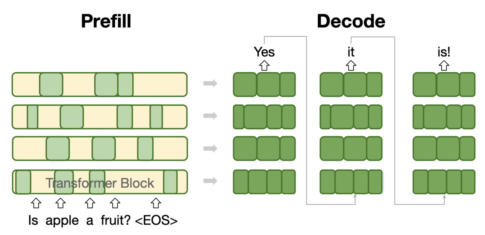

# OverFill



This repo contains the code and released models for our paper:  
[OverFill: Two-Stage Models for Efficient Language Model Decoding]()

OverFill uses a full model for the *prefill* stage, processing system and user inputs in parallel. It then switches to a *dense pruned model* for token-by-token *decoding*. By leveraging more compute during prefill, OverFill achieves a better efficiency-accuracy tradeoff compared to traditional one-stage decoding.

---

## 💾 Released Models

We release OverFill decoders in two sizes:

- [1B Decoder](https://huggingface.co/friendshipkim/overfill-Llama-3.2-3B-Instruct-pruned-h0.45-i0.45-a0.0-d0.0)
- [3B Decoder](https://huggingface.co/friendshipkim/overfill-Llama-3.1-8B-Instruct-pruned-h0.43-i0.43-a0.0-d0.0)

---

## 🚀 Setup

```bash
# Create conda environment
conda create -n overfill python=3.10
conda activate overfill

# Install dependencies
pip install -r requirements.txt

# Install flash-attn
ninja --version && echo $?  # should return 0
pip install flash-attn==2.6.3 --no-build-isolation

# Install alignment-handbook
mkdir tmp && cd tmp
git clone https://github.com/huggingface/alignment-handbook.git
cd alignment-handbook
git checkout e057d7f
python -m pip install .

# Install lm_eval
cd ..
git clone https://github.com/EleutherAI/lm-evaluation-harness.git
cd lm-evaluation-harness
git checkout 370e2f9
python -m pip install -e .
pip install lm-eval[math] lm-eval[ifeval]

# Install OverFill
cd ../..
python -m pip install -e .
```

---

## 💡 Prepare Pruned Model

You can either use existing pruned models:

- Llama 3.2 3B → 1B:  
  [friendshipkim/Llama-3.2-3B-Instruct-pruned-h0.45-i0.45-a0.0-d0.0](https://huggingface.co/friendshipkim/Llama-3.2-3B-Instruct-pruned-h0.45-i0.45-a0.0-d0.0)
- Llama 3.1 8B → 3B:  
  [friendshipkim/Llama-3.1-8B-Instruct-pruned-h0.43-i0.43-a0.0-d0.0-bf16](https://huggingface.co/friendshipkim/Llama-3.1-8B-Instruct-pruned-h0.43-i0.43-a0.0-d0.0-bf16)

Or you can prune your own model and push it to the Hugging Face Hub or save it locally. Refer to the README in the `pruner` folder.

---

## 🎓 Train

We recommend using 8 GPUs. To change this, modify `recipes/accelerate_configs/deepspeed_zero3.yaml`.

### OverFill Training

#### 3B → 1B

```bash
ACCELERATE_LOG_LEVEL=info accelerate launch --config_file recipes accelerate_configs/deepspeed_zero3.yaml overfill/train.py recipes/llama-3_2-3b-instruct/sft/overfill_width.yaml --report_to=wandb
```

#### 8B → 3B

```bash
ACCELERATE_LOG_LEVEL=info accelerate launch --config_file recipes/accelerate_configs/deepspeed_zero3.yaml overfill/train.py recipes/llama-3_1-8b-instruct/sft/overfill_width.yaml --report_to=wandb
```

### Baseline Training

#### Finetune Base Model

```bash
# Finetune Llama 1B
ACCELERATE_LOG_LEVEL=info accelerate launch --config_file recipes/accelerate_configs/deepspeed_zero3.yaml overfill/train_sft.py recipes/llama-3_2-3b-instruct/sft/1b_base.yaml --report_to=wandb
```

```bash
# Finetune Llama 3B
ACCELERATE_LOG_LEVEL=info accelerate launch --config_file recipes/accelerate_configs/deepspeed_zero3.yaml overfill/train_sft.py recipes/llama-3_2-3b-instruct/sft/3b_base.yaml --report_to=wandb
```

#### Finetune Pruned Model

```bash
# Finetune 3B → 1B
ACCELERATE_LOG_LEVEL=info accelerate launch --config_file recipes/accelerate_configs/deepspeed_zero3.yaml overfill/train_sft.py recipes/llama-3_2-3b-instruct/sft/pruned_width.yaml --report_to=wandb
```

```bash
# Finetune 8B → 3B
ACCELERATE_LOG_LEVEL=info accelerate launch --config_file recipes/accelerate_configs/deepspeed_zero3.yaml overfill/train_sft.py recipes/llama-3_1-8b-instruct/sft/pruned_width.yaml --report_to=wandb
```

---

## 🔢 Evaluate
We use the [lm-evaluation-harness](https://github.com/EleutherAI/lm-evaluation-harness) package to evaluate all models.
We provide evaluation scripts in [eval_scripts](./eval_scripts/) for four model types: **OverFill**, **Pruned**, **Finetuned**, and **Instruct (untuned)**.

| Model         | OverFill         | Pruned         | Finetuned       | Instruct        |
|---------------|------------------|----------------|------------------|------------------|
| 1B            | overfill_1b.sh   | pruned_1b.sh   | finetuned_1b.sh  | instruct_1b.sh   |
| 3B Decoder    | overfill_1b.sh   | pruned_3b.sh   | finetuned_3b.sh  | instruct_3b.sh   |
| 8B Decoder    | NA               | NA             | NA               | instruct_8b.sh   |

**Usage:**

```bash
bash eval_scripts/{script_name} <model_path> <task> <n_shot>
```

**Available Tasks:**

- gsm8k_cot_llama
- wmt16-de-en
- ifeval
- arc_challenge_chat
- mmlu_llama
- nq_open

**Notes:**

- For OverFill, Pruned, Finetuned: set `<model_path>` to the local path of your trained model.
- For Instruct: set `<model_path>` to `None`.
- For OverFill, if you want to use our released model instead of your local checkpoint, set `<model_path>` to `None`.
- Results will be saved to `eval_results` folder.

**Examples:**

```bash
# Using locally trained OverFill model
bash eval_scripts/overfill_1b saved_models/3b_instruct_overfill_h0.45-i0.45-a0.0-d0.0 gsm8k_cot_llama 4

# Using released OverFill checkpoint
bash eval_scripts/overfill_1b None gsm8k_cot_llama 4
```

---

## Citation

*To be added after arXiv release.*